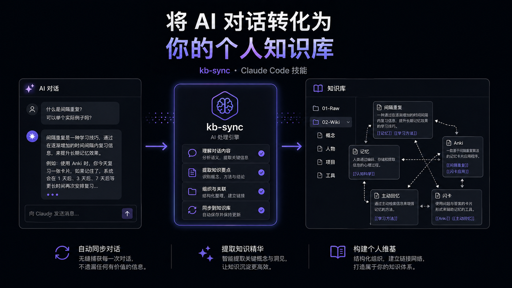

# kb-sync · 知识库自动同步

自动从 Claude Code 对话中提炼知识点，按主题分类写入 Obsidian 知识库；一键处理 Web Clipper 同步到 `01-Raw/` 的文章，提取概念/人物，建立双向链接。



---

## 功能特性

- **对话同步**：将 Claude Code 对话中的核心知识点自动提炼为结构化 Markdown 笔记，支持 LLM 自动提取（Anthropic API）
- **文章处理**：扫描 `01-Raw/` 中的剪藏文章，提取概念、人物，生成/更新 Wiki 页面
- **双向链接**：自动计算语义相似度，在新旧笔记之间建立 `[[双向链接]]`
- **全局配置**：一次初始化，所有项目共享（配置存放在 `~/.kb-sync/`）
- **启动提醒**：每次打开 Claude Code 时自动检测未同步内容和未处理文章
- **幂等同步**：同一内容多次同步不产生重复文件
- **人在回路**：支持 `--preview` 预览提炼结果，确认后再写入

---

## 安装

### 方式一：一键安装（推荐）

```bash
bash setup.sh
```

`setup.sh` 会自动完成以下操作：

1. 安装 skill 到 `~/.claude/skills/kb-sync/`
2. 安装 Python 依赖（anthropic SDK）
3. 检测 API Key 环境变量
4. **自动注入 hooks 到 `~/.claude/settings.json`**（保留原有配置，安全合并）
5. 初始化全局配置 `~/.kb-sync/`
6. 验证安装是否成功

### 方式二：手动安装

如需手动控制每一步：

```bash
# 1. 安装 skill
cp -r skill研究/kb-sync ~/.claude/skills/kb-sync

# 2. 安装依赖
python3 -m pip install anthropic

# 3. 手动配置 hooks
# 编辑 ~/.claude/settings.json，添加 hooks 字段

# 4. 初始化
mkdir -p ~/.kb-sync
```

### 首次初始化

安装完成后，在任意项目的 Claude Code 中输入：

```
/kb-sync --setup
```

按提示选择：
- **全局共享模式（推荐）**：配置存放在 `~/.kb-sync/`，所有项目共用同一个知识库
- **项目级模式**：配置存放在 `./.kb-sync/`，仅当前项目使用

---

## 使用方式

### 命令速查

| 命令 | 说明 |
|------|------|
| `/kb-sync` | 手动同步当前对话到知识库（自动提炼 + 写入） |
| `/kb-sync --preview` | 预览提炼结果，不写入 |
| `/kb-sync --status` | 查看同步状态（待处理会话/文章数） |
| `/kb-sync --setup` | 重新运行初始化设置 |
| `/kb-sync --rollback-last` | 撤销上次同步 |
| `/process-clips` | 处理 `01-Raw/` 中未处理的文章 |

### 自动触发

| 触发时机 | 行为 |
|----------|------|
| **启动时** (`SessionStart`) | 检测未同步会话和未处理文章，输出提醒 |
| **退出时** (`SessionEnd`) | 标记最新会话为待同步，下次 `/kb-sync` 时自动提炼写入 |
| **关键词** (`UserPromptSubmit`) | 输入 `结束对话`/`bye`/`记一下` 等关键词时提示即将同步 |

---

## 配置说明

全局配置文件：`~/.kb-sync/config.json`（或项目级 `./.kb-sync/config.json`）

```json
{
  "paths": {
    "knowledge_base": "/Users/xxx/知识库",
    "clips_dir": "01-Raw",
    "wiki_dir": "02-Wiki",
    "concepts_dir": "概念",
    "figures_dir": "人物",
    "projects_dir": "项目",
    "tools_dir": "工具",
    "staging_dir": "待整理"
  },
  "triggers": {
    "pre_exit": true,
    "keywords": ["结束对话", "bye", "quit", "先这样", "今天就到这", "记一下"]
  },
  "filters": {
    "min_confidence": 0.7,
    "max_entries_per_session": 10
  }
}
```

### 配置查找优先级

1. 优先使用当前目录下的 `./.kb-sync/config.json`（项目级）
2. 如果项目级不存在，回退到 `~/.kb-sync/config.json`（全局级）
3. 两者都不存在时，提示运行 `/kb-sync --setup`

---

## 知识库目录结构

```
知识库/
├── 01-Raw/                 ← 原始输入（Web Clipper、随手记）
│   └── 待整理/             ← 暂存区
├── 02-Wiki/                ← 已整理的永久笔记
│   ├── 概念/               ← 抽象理论、方法论、术语
│   ├── 人物/               ← 作者、专家、关键角色
│   ├── 项目/               ← 具体项目相关的决策与记录
│   └── 工具/               ← 软件使用技巧、CLI 命令
└── CLAUDE.md               ← 知识库规则手册（Obsidian 中可见）
```

---

## Skill 目录结构

```
~/.claude/skills/kb-sync/
├── SKILL.md                  ← Skill 定义与执行流程（Claude Code 加载）
├── README.md                 ← 使用文档
├── prompts/                  ← LLM Prompt 模板
│   ├── extract_dialogue.md   ← 对话提炼 Prompt
│   ├── classify.md           ← 内容分类 Prompt
│   └── process_article.md    ← 文章处理 Prompt
├── scripts/                  ← 核心逻辑（Python）
│   ├── hook_runner.py        ← CLI 入口：参数解析 + 路由分发
│   ├── session_hooks.py      ← 自动触发事件（SessionStart/End、PromptSubmit）
│   ├── cli_commands.py       ← 手动命令处理（--sync、--status、--rollback-last）
│   ├── extractor.py          ← LLM 提炼流程编排（jsonl → LLM → 知识库）
│   ├── jsonl_parser.py       ← jsonl 解析器：提取对话文本、过滤噪音
│   ├── llm_client.py         ← Anthropic API 客户端：加载 Prompt、调用、解析 JSON
│   ├── sync_engine.py        ← 同步引擎：格式化笔记、写入文件、建立双向链接
│   ├── state.py              ← 状态管理：追踪已同步 session、已处理文章
│   ├── config.py             ← 配置管理：读写 config.json、解析知识库路径
│   ├── templates.py          ← 模板渲染：概念页、人物页 Markdown 模板
│   ├── utils.py              ← 工具函数：文件名安全处理、相似度计算、文件扫描
│   └── init_kb.py            ← 首次初始化：创建知识库目录结构
├── tests/                    ← 单元测试（pytest）
└── assets/                   ← 文档图片资源
```

### 调用关系

```
hook_runner.py
    ├── --session-start   → session_hooks.py → 检测待处理内容
    ├── --session-end     → session_hooks.py → 标记 pending_session
    ├── --prompt-submit   → session_hooks.py → 关键词检测
    ├── --sync            → cli_commands.py  → extractor.py → LLM → 写入知识库
    ├── --preview         → cli_commands.py  → extractor.py → LLM → 仅预览
    ├── --status          → cli_commands.py  → 读取 state/config
    └── --rollback-last   → cli_commands.py  → 清空同步记录
```

## 开发

```bash
cd ~/.claude/skills/kb-sync
python3 -m pytest tests/ -v
```

---

## License

MIT
